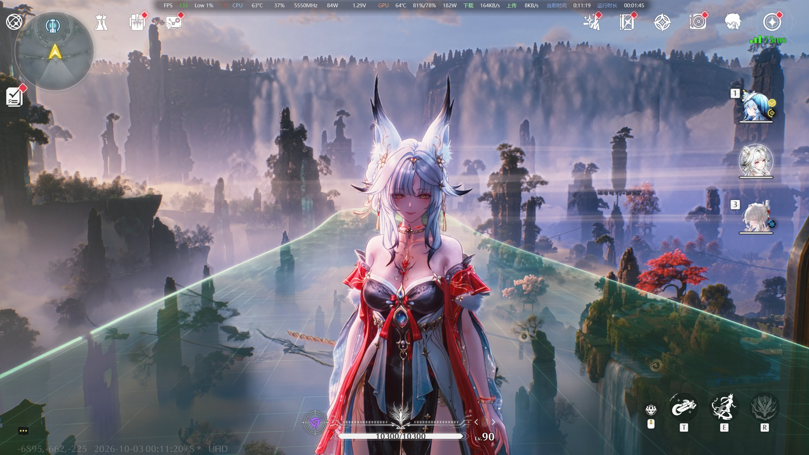

# WuwaUID

A ReShade add-on that hides the on-screen player **UID** in **Wuthering Waves**
(DirectX 12) by suppressing exactly one draw call per frame.

No XXMI, no WWMI, no 3DMigoto, no DXIL patching, no per-version offsets — and no
hotkeys or configuration. The add-on hides the UID from the first frame and
otherwise stays out of the way.



> ### Disclaimer
>
> Wuthering Waves ships an anti-cheat. This add-on talks only to the official
> ReShade add-on API — it does not modify game files, read game memory, inject
> code, or hook any vtable — but ReShade itself injects into the game process,
> which some games treat as a violation of their terms of service.
>
> **Whether this is detectable or bannable is unknown. Use at your own risk.**
> The same question in the WuwaTFR README is answered with a single word:
> *"Unknown."*

## Features

- **Hides the UID** by preventing its draw command from reaching the command queue
- **No configuration** — the target draw is compiled into the binary
- **No hotkeys, no overlay, no ImGui** — nothing to press, nothing to learn
- **No shader patching** — no DXC runtime, no bytecode rewriting, no validation step
- **Coexists with other ReShade add-ons** (tested alongside WuwaTFR and a DLSS add-on)
- **Tiny** — a single ~211 KB `.addon64` with no external dependencies

## Requirements

- Wuthering Waves running in **DirectX 12** mode
- **ReShade 6.x** configured to load add-ons, with the add-on search path
  pointing at the game's `Binaries\Win64` directory
- 64-bit Windows

## Installation

Copy **one file** into the directory where ReShade looks for add-ons. That is
usually the same directory as the game executable:

```
<game>\Client\Binaries\Win64\
    ├── Client-Win64-Shipping.exe
    ├── dxgi.dll                 ← ReShade
    └── WuwaUID.addon64          ← this add-on
```

Or run `install.bat`, which probes the usual Steam / Epic / standalone layouts
first and only asks for a path if none matches. You can also pass the directory
explicitly:

```
install.bat "D:\Wuthering Waves\Wuthering Waves Game\Client\Binaries\Win64"
```

ReShade loads 64-bit add-ons from files ending in `.addon64`. Check
`ReShade.log` afterwards — you should see:

```
Searching for add-ons (*.addon, *.addon64) in '...\Binaries\Win64' ...
Loading add-on from '...\WuwaUID.addon64' ...
Registered add-on "WuwaUID" v0.0.0.0 using ReShade API version 20.
```

There is **no `.ini` to place and no `.dll` to keep next to it**.

## Verifying it works

The add-on writes **`WuwaUID.status.txt`** next to itself, refreshed about
twice a second:

```
WuwaUID live status
===================
mode                : automatic (target baked in, no hotkeys)
frames              : 8310
draws seen          : 6724048
draws suppressed    : 1832
  of which built-in : 1832
active rules        : 1

--- diagnostics ---
pipelines seen      : 4391 (with pixel shader: 2324)
pipeline binds      : 2300225 (PS hash resolved: 2278362)
command lists       : 46
draws w/o bound PSO : 0

active rules:
  [0] ps=5B44B3683F03BAE3 count=156 inst=1 first=0 voff=0 indexed=1   (built-in)
```

| Reading | Meaning |
|---|---|
| `of which built-in` keeps climbing | The rule is matching — the UID should be invisible |
| Stays at `0`, UID still visible | The pixel shader hash no longer matches (see below) |
| `draws w/o bound PSO` is not `0` | ReShade is not reporting pipeline binds — please open an issue |
| `with pixel shader` is `0` | Wrong build loaded |

`draws suppressed` works out to roughly **0.2 per frame**, not 1. The UI layer
does not redraw the digits every frame, so this is expected rather than a missed
suppression.

## How it works

Everything happens through the documented ReShade add-on API:

1. **Index pipelines.** `addon_event::init_pipeline` fires for every new PSO.
   The pixel shader bytecode is hashed with FNV-1a into a `PSO handle → hash`
   table.

2. **Track state.** DX12 draw commands carry no state, so it has to be tracked:
   `addon_event::bind_pipeline` records which PSO each command list has bound,
   and `reset_command_list` clears it.

   > **The one non-obvious part.** This must *not* be filtered on
   > `pipeline_stage`. DX12 binds an entire PSO in a single call and ReShade
   > does not reliably report a `pixel_shader` bit for it, so testing that mask
   > silently drops every graphics bind and leaves every draw looking like it
   > has no pixel shader. This was the bug that broke the first release.

3. **Fingerprint.** Each `draw` / `draw_indexed` yields

   ```
   DrawKey { PS hash, index count, instance count, first index, base vertex, indexed }
   ```

4. **Match.** The fingerprint is compared against the rule list. The list holds
   a handful of entries at most, so a linear scan beats a hash lookup on the
   draw path.

5. **Suppress.** The callback returns `true`. From the ReShade documentation:

   > *To prevent this command from being executed, return `true`, otherwise
   > return `false`.*

   The draw never enters the command queue. This is a supported API behaviour,
   not a hack.

## When it stops working

The only thing that breaks it is a **game update that changes its shaders** —
the baked-in `ps=` hash stops matching and the UID comes back. To confirm, look
at `of which built-in` in the status file: if it sits at `0`, that is what
happened.

Re-deriving the target requires the bisection tooling described in
[How the target was found](#how-the-target-was-found). That tool is not shipped
here on purpose: it is a few hundred lines of throwaway UI, and shipping a
search tool invites people to mis-click their way into suppressing the wrong
draw call.

## Adding rules

Optionally, `WuwaUID.ini` next to the add-on can *add* rules. It is read once at
load and is **never written** — deleting it changes nothing, and it can never
remove a built-in rule.

```ini
[WuwaUID]
Blocked=1
K0=5B44B3683F03BAE3,156,1,0,0,1
```

The value format is `ps,count,inst,first,voff,indexed`. To add a rule
permanently, put it in `kBuiltinRules` in `src/main.cpp` and rebuild.

## Building from source

Requires CMake ≥ 3.20 and MSVC (VS 2022 or Build Tools).

```powershell
# 1. Get the ReShade headers (any revision you intend to target)
git clone --depth 1 https://github.com/crosire/reshade.git

# 2. Configure — the include path must be ASCII, a non-ASCII path breaks header lookup
cmake -S . -B build -G "Visual Studio 17 2022" -A x64 `
      "-DRESHADE_INCLUDE_DIR=$PWD\reshade\include"

# 3. Build
cmake --build build --config Release

# 4. The artifact
#    build\Release\WuwaUID.addon64
```

The add-on is built against ReShade revision `aae2b7ec` (API version 20) and
tested with ReShade 6.8.0.

## Uninstalling

Delete `WuwaUID.addon64` (and optionally `WuwaUID.status.txt`). Nothing else is
touched — no registry keys, no files elsewhere, no traces in the game directory.

## How the target was found

The target was narrowed down by **bisecting the game's draw calls**. The
candidate list runs into the thousands, so walking it one entry at a time is not
practical; halving the range resolves it in `log2(n)` steps.

| Key | Action |
|---|---|
| `F7` | Undo the previous narrowing (for when the screen was misread) |
| `F8` | Rebuild the candidate list, reset the range to `[0, all)` |
| `F9` | Suppress everything in the left half of the current range |
| `F10` | UID disappeared → keep the left half |
| `F11` | UID still visible → keep the right half |
| `F12` | Clear learned rules (built-in rules survive) |

When the range collapses to a single candidate it is committed automatically. It
converged in `log2(2115) ≈ 12` rounds, and the recorded undo depth was exactly
`12` — every round was answered correctly.

**Two mistakes worth recording:**

1. **The first attempt converged on the wrong target** — `count=3`, a single
   triangle, which cannot be a UID. One of the 12 rounds had been misread, and
   there was no undo at the time. That is why `F7` exists.

2. **The per-frame cap was too tight.** The initial threshold of 2.5 rejected
   far too much; a multi-glyph HUD string can be issued as **one draw per
   character**, so a reasonable cap is much higher (32 was used).

**Candidate filter**, for anyone redoing this: seen ≥ 3 times, `inst == 1`,
`count ∈ (0, 200000]`, ≤ 32 draws per frame, ranked by `|per_frame − 1|`
ascending — a HUD element drawn exactly once per frame naturally sorts to the
front.

The winning fingerprint:

```
ps=5B44B3683F03BAE3  count=156  inst=1  first=0  voff=0  indexed=1
```

156 indices is 52 triangles, which matches the geometry of a short string of
digits plus its background.

## Credits

- [ReShade](https://reshade.me/) by crosire — the add-on API this is built on
- [WuwaTFR](https://github.com/wuwatfr/wuthering-waves-transparency-filter-remover)
  — a sibling add-on for the same game; its source was read while working out
  the ReShade DX12 event model, and the install layout here follows it

## License

[MIT](LICENSE). A Chinese translation of this document is available at
[README.zh-CN.md](README.zh-CN.md).
